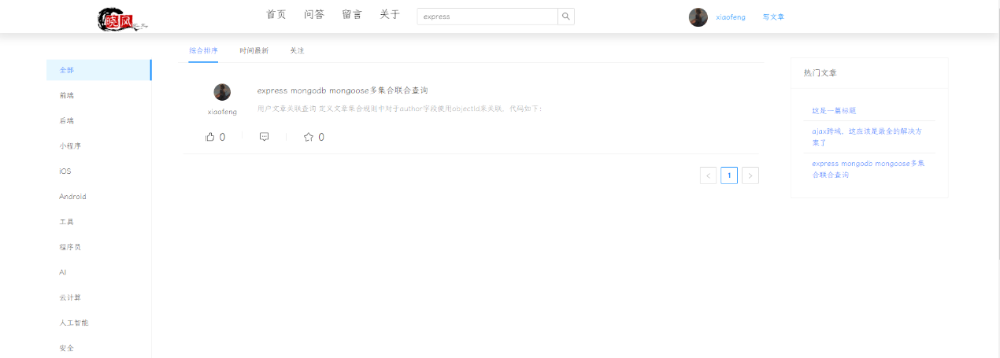

## 已经实现功能
- [x] 个人中心（用来设置博主的各种信息）
- [x] 登录
- [x] 文章管理
- [x] 评论
- [x] 用户注册
- [x] 时间轴管理
- [x] 身份验证

## 待实现功能
- [ ] 留言管理
- [ ] 标签管理
- [ ] 友情链接管理
- [ ] 第三方 github 授权登录
- [ ] 文章归档

## 技术
- "antd": "^4.18.2"
- "antd-img-crop": "^4.2.1"
- "axios": "^0.24.0",
- "braft-editor": "^2.3.9",
- "braft-extensions": "^0.1.1"
- "braft-utils": "^3.0.12"
- "diff": "^5.0.0"
- "draft-js-prism": "^1.0.6"
- "htmldiff": "^0.0.4"
- "htmldiff-js": "^1.0.5"
- "moment": "^2.29.1"
- "prismjs": "^1.26.0"

## 截图
1. 首页

2. 注册

3. 编写博客

4. 编辑博客
